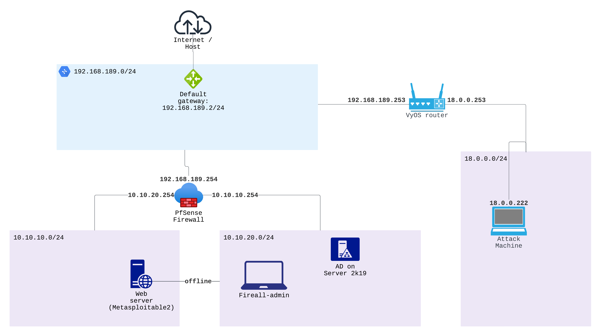

(Working on it - April 22, 2023. May add docker containers)
## Project overview:
### Intro:
This project aims to provide a manual/guide to creating a home lab. This home lab helps one to create an enterprise network, exploit it, and learn more from it. These instructions are provided based on what I could take away from Mr. Jeff McJunkin's [kickass home lab](http://bit.ly/kickasslab)
### Learning mode
Using an example. It contains:
- Details on how to set up the network with a web server. 
- An example attack scenario
- Instructions on how to:
	- Collect the network traffic
	- Perform computer forensics on an exploited machine
### Possible use cases:
- Perform an attack -> export the network dump (pcap files) -> train employees to find the exploited vulnerabilities
- A quick[^1] and safe environment for trying firewall rules, exploitation techniques, and tools.
- You can create vulnerable systems, share them, grow as a group, perform pen-test or red team scenarios, and make reports.
- Perform forensics on exploited machines
### What one can get from this manual:
- I made a bunch of mistakes, and you can avoid them
- Links and references that helped me understand the topics

## Home lab manual

### Example network:

### Phase1 summary:
#### Network:
- Make a NAT network (`192.168.189.0/24`) as the WAN network for the PfSense firewall.
- Make a host-only network (`10.10.20.0/24`) as the LAN network for the PfSense firewall that acts as an example internal network. (DHCP is enabled, but we assign static addresses)
- Make a host-only network DMZ (`10.10.10.0/24`) and connect the metasploitable2 machine. The metaspoloitable2 machine has a connection to the LAN network but is currently offline.
- Port forward the default metasploitable2's website to the WAN port 8080.
- Create another host-only network (`18.0.0.0/24`) for the attacker. Install the VyOS router with the same gateway (`192.168.189.2/24`) as the PfSense WAN network. (Why? - an extra step that might help you simulate your scenario or to make it a bit more realistic/challenging)
- Enable port-forwarding on the attacker's router (VyOS router - port 80, 443) for the reverse shells. 
- From the PfSense interface, use `tcpdump` and enable packet capture before the attack.
#### Attack scenario:
- Recon the WAN network `192.168.189.0/24` using `nmap` (Disable host discover `-Pn`). You'll find the firewall address
- Scan the firewall IP address, and you may find the open port for the website. Learn more by using `nmap` or other tools like Nesus.
- `searchsploit` or `exploit.db` for payloads. Exploit the system, gain user access, and point the reverse shell to the VyOS router address port 80
- Escalate privileges, and gain root access through another reverse shell. Use port 443 of the same router.
- Check the current network interfaces. You will find an offline interface.
- Bring up the interface. It connects to the LAN network.
- Scan the internal (LAN) network using `nmap`, find vulnerable systems, move laterally, and learn more about the enterprise.
#### Forensics:
- Use the `pcap` file from the packet capture. Learn what vulnerabilities the attacker used for exploitation.
- Also, you can perform memory analysis using `vmem` files (you can see them when you take a snapshot of the machine). These files can help if you consider a scenario where the SOC team finds abnormal activity and takes a memory dump of that system.

### Detailed steps:

## [Note]
1. Use LAN segments if you are dealing with malware analysis. You may need to follow additional steps to isolate the machine.
My takeaway:
- I believe that something like this could've been useful for my past self to understand basic concepts of networking and penetration testing. So, I'm sure it can help someone who wants to learn or teach.
- Looks too simple or basic? Good, that was the point. Can you do better? That is the expected outcome. If you can understand and follow along, you can make and test better scenarios.

## References:

[^1]: This is faster to set up when compared to working with a level 1 hypervisor.
